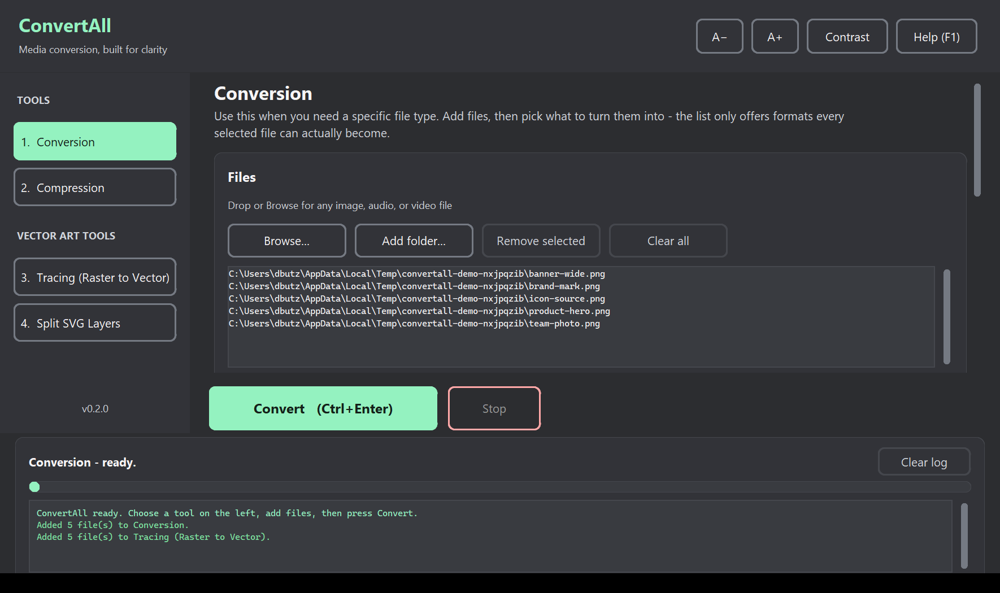
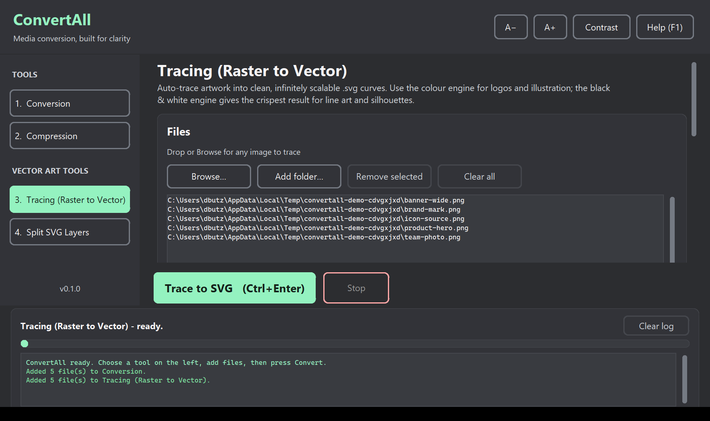
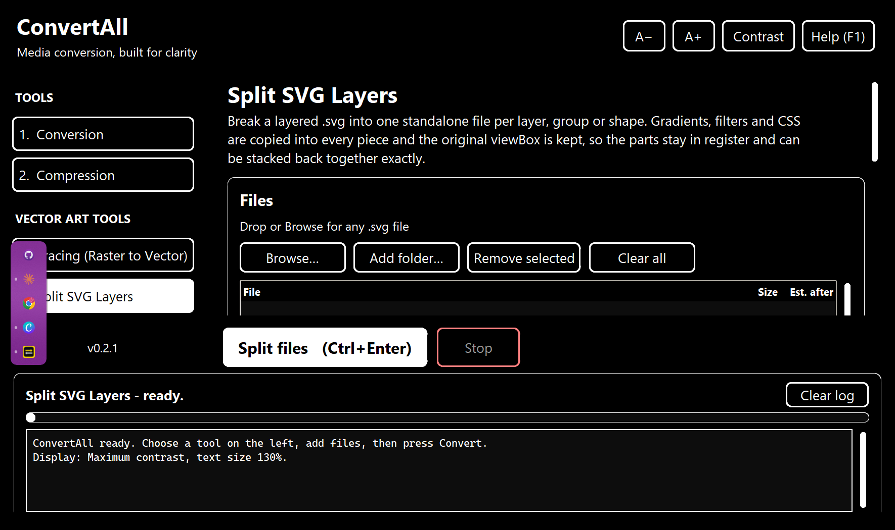

<div align="center">

# ConvertAll

**Batch-convert images (includes vector art), audio, and video — tracing, SVG splitting, and compression with no visible or audible loss.**

[](https://github.com/alirisner14/ConvertAll/actions/workflows/ci.yml)
[](https://www.python.org/downloads/)
[](LICENSE)
[](https://github.com/astral-sh/ruff)



</div>

---

ConvertAll is a desktop utility that does four media chores which normally need
four different tools, in one window: convert a file to a specific format,
squeeze a file down without visible or audible loss, trace artwork into vectors,
and split a layered SVG into its parts.

It runs entirely on your machine. Nothing is uploaded, nothing phones home, and
no original file is ever overwritten.

## Features

Two tools do most of the work — **Conversion** when you need a particular file type, **Compression** when you just want the file smaller. Vector work lives in its own group.

| Tool | What it does |
| --- | --- |
| **Conversion** | For when you need a specific file type. Add images, audio or video and pick the target — the dropdown only offers formats every selected file can actually become. Covers `.png → .webp`, `.heic → .png/.jpg`, `.png/.jpg → .ico`, and `.wav → .mp4` or `.flac`. |
| **Compression** | For when a smaller file is the goal and the format is not. Each type gets the encoder settings that suit it, tuned to stay visually and audibly lossless. |
| **Tracing (Raster to Vector)** | Auto-traces artwork into scalable `.svg`. Two Potrace-based engines: posterised colour layers for artwork, pure black & white for line art. |
| **Split SVG Layers** | Splits any layered `.svg` into one standalone file per layer, group or shape. Universal — no assumptions about which editor made the file. |

Tracing, with the engine and detail controls:



## Requirements

- **Python 3.10 or newer**
- **FFmpeg** — optional. If it is not on your `PATH`, ConvertAll uses the binary
  bundled in the `imageio-ffmpeg` wheel, so there is nothing to install by hand.

Everything else installs from PyPI - eight packages, all pure wheels. There is
no Potrace binary to track down, no ImageMagick and no Inkscape.

## Install

```bash
git clone https://github.com/alirisner14/ConvertAll.git
cd ConvertAll
python -m venv .venv
```

Activate the environment:

```powershell
.\.venv\Scripts\Activate.ps1
```

```bash
source .venv/bin/activate
```

Then install and run:

```bash
pip install -r requirements.txt
python -m convertall
```

### Command-line options

```bash
python -m convertall --contrast maximum --text-scale 1.3
```

| Flag | Values | Meaning |
| --- | --- | --- |
| `--contrast` | `dark`, `maximum` | Palette to start in |
| `--text-scale` | `0.85`–`1.6` | Starting text size |
| `--version` | | Print the version and exit |

## Usage

1. Pick a tool in the left sidebar (or `Ctrl + 1` … `Ctrl + 4`). The first two cover most work; the **Vector art tools** group holds tracing and SVG splitting.
2. Add files — drag them onto the list, or use **Browse** / **Add folder**.
   Folders are searched recursively and filtered to the types that tool accepts.
3. Adjust the options. The defaults are the safe choice for every tool.
4. Choose where output goes, or accept the default `ConvertAll Output` folder
   next to your first input file.
5. Press **Convert** (`Ctrl + Enter`). Progress, per-file results and the size
   saved show up in the activity log. `Esc` stops after the current file.

ConvertAll never overwrites anything. If a name is taken it writes
`filename (2).ext` instead.

## How the compression stays lossless

"Smaller" is easy; "smaller *and* indistinguishable" is the whole point. The
rules the pipeline follows:

| Input | Treatment | Why |
| --- | --- | --- |
| Flat artwork / logos (PNG) | **True lossless WebP** | Under ~256 colours, lossless WebP beats lossy WebP on size *and* is bit-exact. |
| Photographs | WebP q95 (`method=6`) | Above the visually-lossless threshold; typically 40–70% smaller than PNG. |
| JPEG | q95, progressive, no chroma subsampling | 4:4:4 keeps coloured text and fine edges clean. |
| PNG | `optimize`, `compress_level=9` | Lossless by definition. |
| WAV / AIFF | **FLAC** | Mathematically lossless, usually ~50% smaller. |
| MP3 / AAC / OGG | **Left untouched** | Re-encoding lossy audio only destroys it. |
| Video | H.264, H.265 or AV1 at CRF, audio stream copied | Your choice of codec — see below. Audio is copied rather than re-encoded, so it never loses a generation. |
| SVG | Editor metadata stripped, coordinates rounded to 2dp | Geometry is never altered. |

And a safety net: if an "optimised" file comes out *larger* than the original,
ConvertAll keeps the original and says so in the log. This matters most for
video — anything already efficiently encoded, or in a newer codec than H.264,
can grow when re-encoded, so it is left alone.

## Choosing a video codec

The Compression tool lets you pick the codec. Measured on screen-recording content
(a lecture capture, slides with slow movement) against an H.264 source:

| Codec | Size saved | Encode speed | Use it when |
| --- | --- | --- | --- |
| **H.264** | — | ~3× realtime | The file has to play on anything, including old hardware |
| **H.265 / HEVC** | ~17% | ~2× realtime | You want a decent saving without a long wait |
| **AV1** | ~34% | ~0.5× realtime | You are archiving and size matters more than time |

AV1 saves roughly twice what H.265 does and costs about four times the encode
time. For a one-hour recording that is roughly two hours of encoding — fine
overnight, painful if you are waiting.

Two things worth knowing before you compress a large library:

- **Nothing is ever overwritten.** Output goes to a separate folder, so you
  need room for both copies while the job runs. Check the results before you
  delete any originals.
- **Playback support.** H.264 plays everywhere. AV1 needs a recent player —
  VLC, any current browser, or Windows with the AV1 Video Extension. H.265 on
  Windows may prompt you to buy Microsoft's HEVC extension; VLC plays it free.

## Project layout

```
ConvertAll/
├── convertall/
│   ├── __main__.py       # entry point and dependency check
│   ├── app.py            # the window, tool panels, event loop
│   ├── widgets.py        # accessible buttons, lists, log view
│   ├── theme.py          # contrast-verified palettes and type scale
│   ├── jobs.py           # background worker thread + event queue
│   └── core/             # all processing — GUI-free and unit-tested
│       ├── convert.py    # what a file can become, and how to get it there
│       ├── images.py     # PNG/HEIC/JPG/WebP/ICO
│       ├── media.py      # audio → MP4, A/V re-encoding (FFmpeg)
│       ├── vectorize.py  # Potrace auto-tracing (colour + mono)
│       ├── svgsplit.py   # layer/group/shape splitting
│       └── compress.py   # type-aware smart compression
├── tools/                # icon generator, GUI smoke test / screenshots
├── tests/                # pytest suite, no display required
└── .github/workflows/    # CI and release automation
```

Everything in `convertall/core/` is a plain function that takes paths and
returns a `TaskResult`. You can import and script any of it without touching the
GUI:

```python
from pathlib import Path
from convertall.core import convert_image, split_svg

convert_image(Path("logo.png"), Path("out"), target="ico")
split_svg(Path("artwork.svg"), Path("out"), mode="auto")
```

## Design notes

Ordinary desktop software, built carefully. Nothing here is a mode you have to
turn on.

- **Two palettes.** The default is a charcoal ground with off-white text and a
  mint accent. *Maximum contrast* is white on black, where the selected item
  inverts rather than relying on a hue at all. `Ctrl + D` switches.
  

- **The colours are measured, not guessed.** Every pairing clears WCAG 2.1 AAA
  (7:1), and `tests/test_theme.py` recomputes them on every build, so a colour
  tweak that hurts legibility fails CI instead of shipping.
- **No saturated yellow.** It scores well on a contrast chart and is tiring to
  look at for an hour. Both palettes hit their numbers without it.
- **Text scales 85–160%** with `Ctrl + +` / `Ctrl + -`. The layout reflows
  rather than clipping. It starts at normal desktop size.
- **Hover and focus never look alike.** The accent is mint, the focus ring
  orange — about 125° apart in hue, which a contrast ratio cannot express and a
  test checks directly. Focus outranks hover, so the mouse never hides where
  the keyboard is.
- **Everything works from the keyboard.** Tab moves, Enter or Space activates,
  every action has a shortcut (`F1` lists them).
- **Help text is visible, not hovered.** Options carry printed descriptions;
  tooltips are unreachable by keyboard and screen readers.
- **Native list and log widgets**, so assistive technology sees real text.

## Development

```bash
pip install -r requirements.txt -r requirements-dev.txt
pytest              # run the test suite
ruff check .        # lint
ruff format .       # format
```

VS Code users get interpreter, test, lint and debug configuration out of the box
from `.vscode/`. Press <kbd>F5</kbd> to launch the app under the debugger.

See [CONTRIBUTING.md](CONTRIBUTING.md) before opening a pull request.

## Troubleshooting

**"HEIC support missing"** — `pip install pillow-heif`.

**"FFmpeg was not found"** — `pip install imageio-ffmpeg`, or install FFmpeg and
put it on your `PATH`.

**Drag and drop does nothing** — `pip install tkinterdnd2`. The app works without
it; the buttons do the same job.

**"Only one layer found"** when splitting — the SVG has no separate groups to
split. Try *Every individual shape* in the **Split by** menu.

**Tracing a photo produces a huge SVG** — that is expected. Auto-tracing suits
flat artwork, logos and line art, not photographs. Use *Simplified* detail,
which posterises to four colours before tracing.

**Tracing produced the negative of my artwork** — the black & white engine fills
everything *darker* than the threshold. Raise or lower the threshold slider, or
tick **Invert** for light artwork on a dark background.

## Versioning

ConvertAll follows [Semantic Versioning](https://semver.org/). Releases are
recorded in [CHANGELOG.md](CHANGELOG.md).

## License

[MIT](LICENSE).

ConvertAll builds on [Pillow](https://python-pillow.org/),
[FFmpeg](https://ffmpeg.org/), [Potrace](http://potrace.sourceforge.net/) (via
the pure-Python [potracer](https://github.com/tatarize/potrace) port),
[lxml](https://lxml.de/) and
[CustomTkinter](https://github.com/TomSchimansky/CustomTkinter). FFmpeg is
distributed under the LGPL/GPL; see [ffmpeg.org/legal](https://ffmpeg.org/legal.html).
