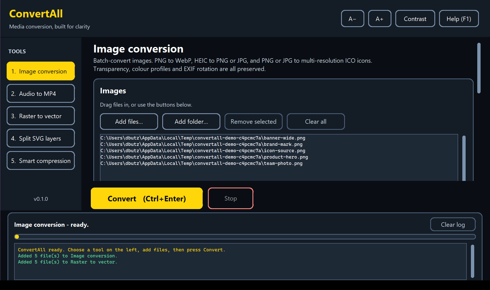

<div align="center">

# ConvertAll

**An accessible, high-contrast batch converter for images (includes vector art), audio, and video.**

[](https://github.com/alirisner14/ConvertAll/actions/workflows/ci.yml)
[](https://www.python.org/downloads/)
[](LICENSE)
[](https://github.com/astral-sh/ruff)



</div>

---

ConvertAll is a desktop utility that does the five media chores that normally need
five different tools — and does them without asking you to squint. The interface
is built around a WCAG-AAA contrast palette, keyboard access for every control,
and text you can scale on the fly.

## Features

| Tool | What it does |
| --- | --- |
| **Image conversion** | Batch `.png → .webp`, `.heic → .png/.jpg`, and `.png/.jpg → .ico` (multi-resolution). Alpha, ICC colour profiles and EXIF rotation survive the trip. |
| **Audio to video** | Wraps `.wav` (or MP3/FLAC/M4A…) into a `.mp4` container with either a still background image or a synthesised flat-colour track. |
| **Raster to vector** | Auto-traces artwork into scalable `.svg`. Two Potrace-based engines: posterised colour layers for artwork, pure black & white for line art. |
| **SVG splitting** | Splits any layered `.svg` into one standalone file per layer, group or shape. Universal — no assumptions about which editor made the file. |
| **Smart compression** | Type-aware optimisation across every supported format, tuned to stay visually and audibly lossless. |

## Accessibility

This is the part that is easy to skip and shouldn't be.

- **Two high-contrast palettes.** The default dark theme clears WCAG 2.1 **AAA**
  (7:1) for body text; the *Maximum contrast* palette is pure black/white/yellow
  at 21:1. Toggle with `Ctrl + D`.
- **Live text scaling.** `Ctrl + +` / `Ctrl + -` scale every label, button and
  list in the app from 85% to 160%. The layout reflows; nothing is clipped.
- **Hover and focus never share a signal.** Hover is amber fill *and* border;
  keyboard focus is a 3px cyan ring. You can always tell which is which — and
  hover flips the label colour too, so contrast never drops on the way past.
- **Everything is keyboard reachable.** Tab moves, Enter/Space activates, and
  every action has a shortcut (press `F1` for the full list).
- **Help text is visible, not hovered.** Options carry printed descriptions
  rather than tooltips, which keyboard and screen-reader users cannot reach.
- **Native list and log widgets**, so assistive technology sees real text.

The *Maximum contrast* palette at 130% text, showing how the layout reflows
rather than clipping:


## Requirements

- **Python 3.10 or newer**
- **FFmpeg** — optional. If it is not on your `PATH`, ConvertAll uses the binary
  bundled in the `imageio-ffmpeg` wheel, so there is nothing to install by hand.

Everything else installs from PyPI - eight packages, all pure wheels. There is
no Potrace binary to track down, no ImageMagick and no Inkscape.

## Install

```bash
git clone https://github.com/alirisner14/ConvertAll.git
cd ConvertAll
python -m venv .venv
```

Activate the environment:

```powershell
.\.venv\Scripts\Activate.ps1
```

```bash
source .venv/bin/activate
```

Then install and run:

```bash
pip install -r requirements.txt
python -m convertall
```

### Command-line options

```bash
python -m convertall --contrast maximum --text-scale 1.3
```

| Flag | Values | Meaning |
| --- | --- | --- |
| `--contrast` | `dark`, `maximum` | Palette to start in |
| `--text-scale` | `0.85`–`1.6` | Starting text size |
| `--version` | | Print the version and exit |

## Usage

1. Pick a tool in the left sidebar (or `Ctrl + 1` … `Ctrl + 5`).
2. Add files — drag them onto the list, or use **Add files** / **Add folder**.
   Folders are searched recursively and filtered to the types that tool accepts.
3. Adjust the options. The defaults are the safe choice for every tool.
4. Choose where output goes, or accept the default `ConvertAll Output` folder
   next to your first input file.
5. Press **Convert** (`Ctrl + Enter`). Progress, per-file results and the size
   saved show up in the activity log. `Esc` stops after the current file.

ConvertAll never overwrites anything. If a name is taken it writes
`filename (2).ext` instead.

## How the compression stays lossless

"Smaller" is easy; "smaller *and* indistinguishable" is the whole point. The
rules the pipeline follows:

| Input | Treatment | Why |
| --- | --- | --- |
| Flat artwork / logos (PNG) | **True lossless WebP** | Under ~256 colours, lossless WebP beats lossy WebP on size *and* is bit-exact. |
| Photographs | WebP q95 (`method=6`) | Above the visually-lossless threshold; typically 40–70% smaller than PNG. |
| JPEG | q95, progressive, no chroma subsampling | 4:4:4 keeps coloured text and fine edges clean. |
| PNG | `optimize`, `compress_level=9` | Lossless by definition. |
| WAV / AIFF | **FLAC** | Mathematically lossless, usually ~50% smaller. |
| MP3 / AAC / OGG | **Left untouched** | Re-encoding lossy audio only destroys it. |
| Video | x264 CRF 18–21, AAC, `+faststart` | CRF 18 is the accepted visually-lossless point for x264. |
| SVG | Editor metadata stripped, coordinates rounded to 2dp | Geometry is never altered. |

And a safety net: if an "optimised" file comes out *larger* than the original,
ConvertAll keeps the original and says so in the log. This matters most for
video — anything already efficiently encoded, or in a newer codec than H.264,
can grow when re-encoded, so it is left alone.

## Project layout

```
ConvertAll/
├── convertall/
│   ├── __main__.py       # entry point and dependency check
│   ├── app.py            # the window, tool panels, event loop
│   ├── widgets.py        # accessible buttons, lists, log view
│   ├── theme.py          # contrast-verified palettes and type scale
│   ├── jobs.py           # background worker thread + event queue
│   └── core/             # all processing — GUI-free and unit-tested
│       ├── images.py     # PNG/HEIC/JPG/WebP/ICO
│       ├── media.py      # audio → video, A/V re-encoding (FFmpeg)
│       ├── vectorize.py  # Potrace auto-tracing (colour + mono)
│       ├── svgsplit.py   # layer/group/shape splitting
│       └── compress.py   # type-aware smart compression
├── tools/                # icon generator, GUI smoke test / screenshots
├── tests/                # pytest suite, no display required
└── .github/workflows/    # CI and release automation
```

Everything in `convertall/core/` is a plain function that takes paths and
returns a `TaskResult`. You can import and script any of it without touching the
GUI:

```python
from pathlib import Path
from convertall.core import convert_image, split_svg

convert_image(Path("logo.png"), Path("out"), target="ico")
split_svg(Path("artwork.svg"), Path("out"), mode="auto")
```

## Development

```bash
pip install -r requirements.txt -r requirements-dev.txt
pytest              # run the test suite
ruff check .        # lint
ruff format .       # format
```

VS Code users get interpreter, test, lint and debug configuration out of the box
from `.vscode/`. Press <kbd>F5</kbd> to launch the app under the debugger.

See [CONTRIBUTING.md](CONTRIBUTING.md) before opening a pull request.

## Troubleshooting

**"HEIC support missing"** — `pip install pillow-heif`.

**"FFmpeg was not found"** — `pip install imageio-ffmpeg`, or install FFmpeg and
put it on your `PATH`.

**Drag and drop does nothing** — `pip install tkinterdnd2`. The app works without
it; the buttons do the same job.

**"Only one layer found"** when splitting — the SVG has no separate groups to
split. Try *Every individual shape* in the **Split by** menu.

**Tracing a photo produces a huge SVG** — that is expected. Auto-tracing suits
flat artwork, logos and line art, not photographs. Use *Simplified* detail,
which posterises to four colours before tracing.

**Tracing produced the negative of my artwork** — the black & white engine fills
everything *darker* than the threshold. Raise or lower the threshold slider, or
tick **Invert** for light artwork on a dark background.

## Versioning

ConvertAll follows [Semantic Versioning](https://semver.org/). Releases are
recorded in [CHANGELOG.md](CHANGELOG.md).

## License

[MIT](LICENSE).

ConvertAll builds on [Pillow](https://python-pillow.org/),
[FFmpeg](https://ffmpeg.org/), [Potrace](http://potrace.sourceforge.net/) (via
the pure-Python [potracer](https://github.com/tatarize/potrace) port),
[lxml](https://lxml.de/) and
[CustomTkinter](https://github.com/TomSchimansky/CustomTkinter). FFmpeg is
distributed under the LGPL/GPL; see [ffmpeg.org/legal](https://ffmpeg.org/legal.html).
